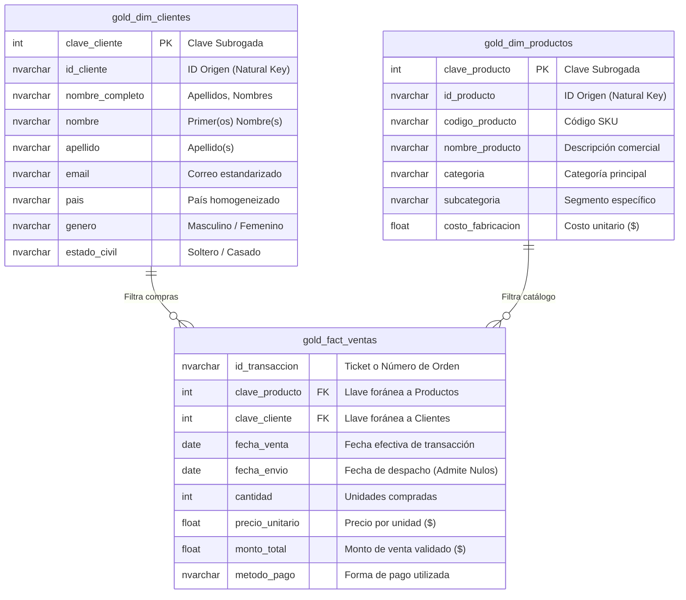

# 📊 Data Warehouse Comercial: Arquitectura Medallion

Bienvenido a la documentación del **Data Warehouse Comercial** desarrollado en **SQL Server**. Este proyecto implementa un flujo automatizado ETL (Extracción, Transformación y Carga) utilizando una arquitectura de mejores prácticas **Medallion (Bronze ➔ Silver ➔ Gold)**. 

El objetivo principal es procesar una fuente de datos transaccional plana (CSV), aplicar reglas de calidad de datos, normalizar entidades y exponer un **Esquema Estrella** optimizado para herramientas de Inteligencia de Negocios (Power BI, Tableau).

---

## 🎯 1. Justificación y Necesidad de Negocio

El reporte de ventas de la empresa se extrae inicialmente como un archivo plano desnormalizado que contiene información transaccional, demográfica del cliente y especificaciones del producto en una sola sábana de datos. Esto genera:
* **Redundancia de Datos:** Atributos de clientes y productos repetidos en miles de transacciones.
* **Problemas de Calidad:** Inconsistencias en formatos de fechas, montos en cero y nomenclaturas de países dispares.
* **Bajo Rendimiento Analítico:** Lentitud al intentar segmentar dimensiones clave directamente desde un archivo plano.

**Solución Implementada:** Un flujo ETL orquestado mediante Procedimientos Almacenados que consolida, audita y modela los datos en un Data Warehouse robusto.

---

## ⚙️ 2. Arquitectura del Flujo de Datos

El proyecto sigue una estrategia de capas progresivas para garantizar la trazabilidad y calidad del dato:

1. **🥉 Capa Bronze (Área de Ingesta):** 
   * Extrae los datos exactos del archivo `ventas.csv` sin alteraciones usando `BULK INSERT`.
   * **Entidad:** `bronze.ventas` (Todos los campos se importan como `NVARCHAR` para evitar interrupciones por errores de origen).

2. **🥈 Capa Silver (Limpieza y Normalización):** 
   * Transforma los datos crudos, aplica _casting_ a los tipos correctos (`DATE`, `INT`, `FLOAT`) y resuelve nulos o errores aritméticos.
   * Se normaliza la tabla plana en tres entidades independientes y se agrega una marca de tiempo de auditoría (`dwh_fecha_carga`).
   * **Entidades:** `silver.clientes`, `silver.productos`, `silver.ventas_detalle`.

3. **🥇 Capa Gold (Modelo Dimensional):** 
   * Construida a través de vistas analíticas, conecta los hechos transaccionales con las dimensiones del negocio.
   * Genera dinámicamente **Claves Subrogadas** mediante `ROW_NUMBER()` para asegurar la unicidad y optimizar los cruces (JOINs) en el dashboard.
   * **Entidades:** `gold.dim_clientes`, `gold.dim_productos`, `gold.fact_ventas`.

---

## 📐 3. Diagrama del Modelo de Datos Final (Esquema Estrella)

El siguiente modelo entidad-relación representa la estructura final disponible en la capa Gold, diseñada específicamente para análisis multidimensional:

---

## 🚀 4. Instrucciones de Ejecución (Despliegue)

Para replicar este proyecto en tu entorno local de SQL Server, asegúrate de tener descargado el archivo `ventas.csv`. **Importante:** Debes modificar la ruta del archivo dentro del script de carga para que apunte a la ubicación exacta de tu computadora. 

Ejecuta los scripts en el siguiente orden secuencial:

### Fase 1: Inicialización
1. Ejecutar el script base de inicialización (`Database.sql`) para crear la base de datos `DataWarehouse` y los respectivos esquemas (`bronze`, `silver`, `gold`).

### Fase 2: Ingesta Cruda (Bronze)
2. Ejecutar **`DDL_Bronze.sql`** para crear la estructura de la tabla temporal.
3. Abrir el script **`SP_Load_Bronze.sql`** y **reemplazar la ruta del archivo** en la instrucción `BULK INSERT` por tu ruta local (ej. `C:\Tu\Ruta\Propia\ventas.csv`). Una vez modificado, ejecuta el script para crear el procedimiento almacenado y luego invócalo con: **`EXEC bronze.load_bronze;**`

### Fase 3: Limpieza y Transformación (Silver)
4. Ejecutar **`ddl_silver.sql**` para crear las tres tablas físicas normalizadas.
5. Ejecutar **`proc_load_silver.sql**` para crear el motor de limpieza y luego invocarlo con **`EXEC silver.load_silver;**`.

### Fase 4: Modelado Analítico (Gold)
Ejecutar **`ddl_gold.sql**` para desplegar el Esquema Estrella mediante Vistas Analíticas, dejándolas listas para la conexión directa con Power BI.
